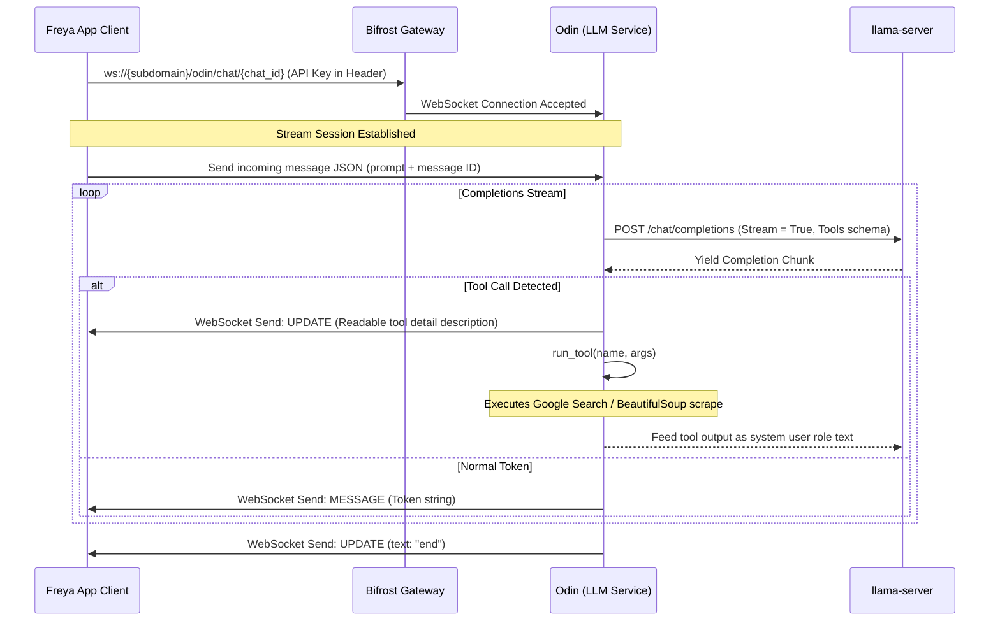
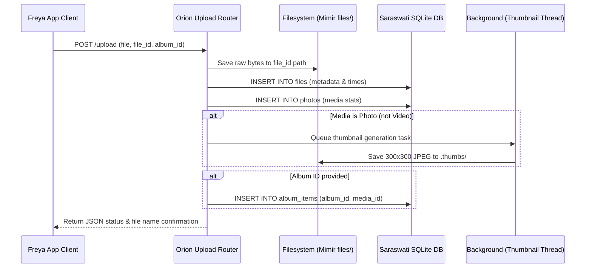

# L.O.R.E Developer & Agent Guide (`Gemini.md`)

Welcome to **L.O.R.E** (Local Omnipresent Repository & Ecosystem), a modular, AI-enabled local file and media home server ecosystem. This guide provides a detailed technical layout of the architecture, database schemas, component communication, and known limitations to help human developers and AI coding agents onboard quickly.

---

## 🗺️ Norse-to-Component Mapping

L.O.R.E relies on Norse mythology terminology for its modular components. Below is the mapping from Norse concepts to their directory structure and role:

| Norse Concept | Code Module / Directory | Technology Stack | Core Role |
| :--- | :--- | :--- | :--- |
| **Bifrost** | [bifrost/](file:///root/Dev/L.O.R.E/bifrost) | FastAPI / Uvicorn | API Gateway, routing, & API key auth |
| **Odin** | [odin/](file:///root/Dev/L.O.R.E/odin) | OpenAI API / Cloud & Local LLM | LLM brain, WebSocket chat, tool-calling |
| **Mimir** | [mimir/](file:///root/Dev/L.O.R.E/mimir) | FastAPI / Local Filesystem | Scoped local file storage & CRUD manager |
| **Orion** | [mimir/orion/](file:///root/Dev/L.O.R.E/mimir/orion) | Pillow / OpenCLIP / PyTorch | Media intelligence, thumbs, video/image embedder |
| **Saraswati** | [mimir/saraswati/](file:///root/Dev/L.O.R.E/mimir/saraswati) | SQLite | Relational metadata store (files, photos, albums) |
| **Psyche** | [psyche/](file:///root/Dev/L.O.R.E/psyche) | ChromaDB | Vector database storing semantic embeddings |
| **Freya** | [freya/](file:///root/Dev/L.O.R.E/freya) | Kotlin / Jetpack Compose | Mobile Android frontend client |

---

## 🏗️ Architecture & Component Details

### ⚡ 1. Bifrost (API Gateway)
* **Entry Point**: Implemented in [bifrost/main.py](file:///root/Dev/L.O.R.E/bifrost/main.py). Hosted at port `2345` on the VPS, exposed via a reverse proxy at `lore.rakshitrajendra.in`.
* **API Key Auth**: Implemented via FastAPI HTTP middleware. Verifies incoming requests contain the `X-Api-Key` matching `API_KEY` in the environment `.env`.
* **Routing**: Aggregates routes from `Odin` (`/odin`), `Mimir` (`/mimir`), and `Orion` (`/orion`).

### 🧠 2. Odin (LLM Service & Web Tools)
* **LLM Engine**: Configured to run `gemma-3-12b-it-Q4_K_M.gguf` on a local llama.cpp server instance at `http://127.0.0.1:8000` (defined in [odin/start_llm_server.py](file:///root/Dev/L.O.R.E/odin/start_llm_server.py)).
* **WebSocket Chat**: Endpoint `/chat/{chat_id}` in [odin/router.py](file:///root/Dev/L.O.R.E/odin/router.py) streams text chunks and status updates (`type: MESSAGE` or `type: UPDATE`) to the client.
* **Agentic Tools**: Declared in [odin/tools/tools.py](file:///root/Dev/L.O.R.E/odin/tools/tools.py). Handles web searches (Google Custom Search API) and fetching webpages (BeautifulSoup parsing) inline to enrich conversation.

### 💾 3. Mimir (Local File Manager)
* **Router**: Found in [mimir/router.py](file:///root/Dev/L.O.R.E/mimir/router.py).
* **Endpoints**: 
  * `GET /mimir/list`: Paginated file and folder navigation.
  * `POST /mimir/upload`: Saves uploaded file to the local directory.
  * `POST /mimir/create_folder`: Directories creation.
  * `PUT /mimir/rename`: Renames folder/files and updates children database paths recursively.
  * `DELETE /mimir/delete`: Deletes file/folder recursively and unlinks database rows.

### 🖼️ 4. Orion (Media Intelligence)
* **Router**: Located in [mimir/orion/router.py](file:///root/Dev/L.O.R.E/mimir/orion/router.py).
* **Features**:
  * Thumbnail Generation: Employs PIL to output `300x300` JPEG previews inside a background task.
  * Embeddings: [mimir/orion/vision/embeddings.py](file:///root/Dev/L.O.R.E/mimir/orion/vision/embeddings.py) uses `open_clip` (`ViT-L-14` / `openai` weights) on CUDA/CPU to generate 768-dimension cosine space vectors.
  * Album Management: Operations to create albums, tag media items, and fetch album contents.

### 🗄️ 5. Saraswati (Metadata Relational Database)
Initialized in [mimir/saraswati/init.py](file:///root/Dev/L.O.R.E/mimir/saraswati/init.py), it sets up SQLite relational metadata. See **Database Schema** below.

### 🧪 6. Psyche (Vector Database)
Initialized in [psyche/init.py](file:///root/Dev/L.O.R.E/psyche/init.py). Integrates ChromaDB PersistentClient to save and retrieve files embeddings under the `file_embeddings` collection.

### 📱 7. Freya (Jetpack Compose Android Client)
* **Client App**: Located in [freya/app](file:///root/Dev/L.O.R.E/freya/app).
* **Authentication**: Intercepts Hilt Net Module Retrofit clients (see [di/NetworkModule.kt](file:///root/Dev/L.O.R.E/freya/app/src/main/java/collector/freya/app/di/NetworkModule.kt)) to automatically inject API token header (`x-api-key: koala`).
* **Views Flow**: Defined in [MainScreen (Freya.kt)](file:///root/Dev/L.O.R.E/freya/app/src/main/java/collector/freya/app/Freya.kt):
  * `ChatScreen`: Streams chats via OkHttp WebSocket listener.
  * `DriveScreen`: List/Upload/Create files and folders.
  * `PhotosScreen`: Visualizes media grid, albums, favorites.
  * `SettingsScreen`: Connects client UI to server host address.

---

## 🗃️ Database Schemas

### SQLite tables (Saraswati)

```sql
CREATE TABLE IF NOT EXISTS files (
    id INTEGER PRIMARY KEY AUTOINCREMENT,
    path TEXT NOT NULL,
    name TEXT NOT NULL,
    parent TEXT NOT NULL,
    is_file BOOLEAN NOT NULL,
    size INTEGER DEFAULT 0,
    modified REAL,
    created REAL,
    favorite BOOLEAN DEFAULT 0,
    UNIQUE(path)
);

CREATE TABLE IF NOT EXISTS photos (
    file_id INTEGER PRIMARY KEY,
    path TEXT NOT NULL UNIQUE,
    name TEXT NOT NULL,
    mime TEXT,
    is_video BOOLEAN,
    width INTEGER,
    height INTEGER,
    duration REAL,
    size INTEGER,
    created REAL,
    modified REAL,
    favorite BOOLEAN DEFAULT 0
);

CREATE TABLE IF NOT EXISTS albums (
    id INTEGER PRIMARY KEY AUTOINCREMENT,
    name TEXT UNIQUE NOT NULL,
    created REAL
);

CREATE TABLE IF NOT EXISTS album_items (
    album_id INTEGER NOT NULL,
    media_id INTEGER NOT NULL,
    PRIMARY KEY (album_id, media_id)
);
```

### ChromaDB Collections (Psyche)
* **Collection Name**: `file_embeddings`
* **Distance Space Metric**: `cosine`

---

## 🔄 Core Data Flows

### A. WebSocket Chat & Tool Execution Flow



### B. Media Upload & Processing Flow



---

## 🛠️ Resolved Tech Debt & Enhanced Features

All previous architectural gaps, hardcoded Windows dependencies, and unimplemented stubs have been successfully resolved:

1. **Environment-Driven Path Resolution**:
   * [constants.py](file:///root/Dev/L.O.R.E/constants.py) now loads directory paths and configuration dynamically from a gitignored local `.env` configuration file (see template in [.env.example](file:///root/Dev/L.O.R.E/.env.example)), avoiding hardcoded drive letters.

2. **Completed Agentic Search & RAG Tools**:
   * All 5 local tools are now fully implemented under [odin/tools/](file:///root/Dev/L.O.R.E/odin/tools/) and wired into the `run_tool` dispatcher:
     * `file_search`: SQLite FTS5 search with matching fallback.
     * `vector_search`: Querying ChromaDB using local OpenCLIP text tower embeddings.
     * `read_file`: Sandboxed file reading with strict size and type check constraints to block path traversals.
     * `describe_photo`: Caching EXIF properties and name descriptors dynamically.
     * `get_metadata`: Merging dimensions, GPS, camera model, and hash metrics into JSON.

3. **Completed Mobile View Flows**:
   * The `TODO()` stubs in [ChatScreen.kt](file:///root/Dev/L.O.R.E/freya/app/src/main/java/collector/freya/app/odin/ChatScreen.kt) have been replaced with full scrolling mechanisms and toast notifications.

